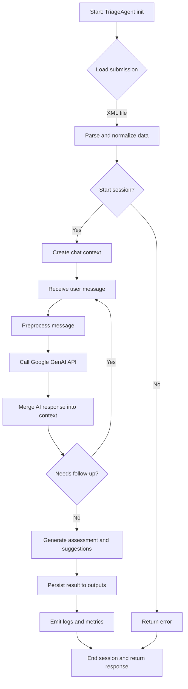

# adk-triage-agent

An intelligent triage agent built with Google GenAI for interactive insurance submission analysis.

## 🌟 Features

- **Interactive Chat Interface** - Conversation-based submission analysis
- **AI-Powered Risk Assessment** - Smart recommendations based on conversation
- **Flexible Workflow** - Explore submissions before confirming decisions
- **Chat History** - Complete conversation logs with assessments
- **Production Ready** - Kubernetes deployment for GKE
- **Auto-scaling** - Handles variable load with HPA
- **Health Monitoring** - Built-in health checks and observability

## Project Structure

```
adk-triage-agent/
│
├── src/                    # Source code
│   ├── agent.py           # Main agent logic with TriageAgent class
│   ├── web_server.py      # Flask web server with API endpoints
│   ├── main.py            # CLI entry point
│   └── templates/         # HTML templates
│       └── index.html     # Web UI
│
├── k8s/                   # Kubernetes manifests
│   ├── namespace.yaml     # Namespace definition
│   ├── secret.yaml        # Secrets (API keys)
│   ├── deployment.yaml    # Application deployment
│   ├── service.yaml       # LoadBalancer service
│   └── hpa.yaml          # Horizontal Pod Autoscaler
│
├── inputs/                # XML submission files
├── outputs/               # Generated JSON triage results
├── tests/                 # Unit tests
├── docs/                  # Additional documentation
│
├── Dockerfile             # Container image definition
├── cloudbuild.yaml        # Google Cloud Build config
├── deploy-gke.ps1         # PowerShell deployment script
├── deploy-gke.sh          # Bash deployment script
├── DEPLOYMENT.md          # Detailed deployment guide
├── PRODUCTION_CHECKLIST.md # Production readiness checklist
│
├── requirements.txt       # Python dependencies
├── requirements-dev.txt   # Development dependencies
├── requirements-prod.txt  # Production dependencies
├── .env.example           # Example environment variables
└── README.md              # This file
```

## 🚀 Quick Start

### Local Development

#### 1. Create and Activate Virtual Environment

```powershell
# Create virtual environment
python -m venv adk_env

# Activate the environment
.\adk_env\Scripts\Activate.ps1
```

#### 2. Install Dependencies

```powershell
# Install main dependencies
pip install -r requirements.txt

# Install development dependencies (optional)
pip install -r requirements-dev.txt
```

#### 3. Configure Environment Variables

```powershell
# Copy the example environment file
copy .env.example .env

# Edit .env and add your Google API key
```

#### 4. Run the Web Application

```powershell
python src/web_server.py
```

Then open your browser to `http://localhost:5000`

#### 5. Run CLI (Interactive Mode)

```powershell
python src/main.py
```

#### 6. Run Tests

```powershell
pytest
```

## 🌐 Web Interface

The application provides a beautiful web interface where you can:

1. **Select a submission** from the dropdown
2. **Chat with the AI** to understand the submission details
3. **Request summaries** with one click
4. **Get risk suggestions** from the AI
5. **Confirm and save** the final assessment

Access it at `http://localhost:5000` after starting the web server.

## 📦 Requirements

**Main Dependencies** (`requirements.txt`):
- `google-genai` - Google GenAI SDK
- `python-dotenv` - Environment variable management
- `flask` - Web framework

**Development Dependencies** (`requirements-dev.txt`):
- `pytest` - Testing framework
- `pytest-cov` - Code coverage
- `black` - Code formatter
- `flake8` - Linter
- `mypy` - Type checker

**Production Dependencies** (`requirements-prod.txt`):
- `gunicorn` - Production WSGI server
- `gevent` - Async worker
- `prometheus-client` - Metrics
- `python-json-logger` - Structured logging

## 🚢 Production Deployment

### Deploy to Google Kubernetes Engine (GKE)

#### Prerequisites
- Google Cloud Platform account
- `gcloud` CLI installed
- `kubectl` installed
- Docker installed

#### Quick Deploy

```powershell
# Set your project ID
$env:GCP_PROJECT_ID = "your-gcp-project-id"

# Run deployment script
.\deploy-gke.ps1 -ProjectId "your-gcp-project-id"
```

#### Manual Deployment

See [DEPLOYMENT.md](DEPLOYMENT.md) for detailed instructions.

#### What Gets Deployed

- **Kubernetes Cluster** on GKE
- **2 replicas** (auto-scales 1-10 based on load)
- **LoadBalancer** with external IP
- **Health checks** for reliability
- **Auto-scaling** based on CPU/memory
- **Secure secrets** management

### Architecture

```
Internet → LoadBalancer → Kubernetes Service → Pods (2-10)
                                                  ↓
                                            Google GenAI API
```

### Deployment Files

- `Dockerfile` - Container image
- `k8s/deployment.yaml` - Kubernetes deployment
- `k8s/service.yaml` - LoadBalancer service  
- `k8s/hpa.yaml` - Horizontal Pod Autoscaler
- `deploy-gke.ps1` - Automated deployment script
- `cloudbuild.yaml` - CI/CD configuration

See [PRODUCTION_CHECKLIST.md](PRODUCTION_CHECKLIST.md) for pre-deployment checklist.

## Development

### Code Formatting
```powershell
black src/ tests/
```

### Linting
```powershell
flake8 src/ tests/
```

### Type Checking
```powershell
mypy src/
```

## 🔧 API Endpoints

- `GET /` - Web interface
- `GET /health` - Health check endpoint
- `GET /readiness` - Readiness check endpoint
- `GET /api/files` - List available submission files
- `POST /api/start-chat` - Start a chat session for a submission
- `POST /api/chat` - Send a message in the chat
- `POST /api/suggest-risk` - Get AI risk assessment suggestion
- `POST /api/confirm` - Confirm and save the final assessment

## 📊 Monitoring

### Local Monitoring
```powershell
# View application logs
kubectl logs -f deployment/adk-triage-agent -n adk-triage-agent

# Check pod status
kubectl get pods -n adk-triage-agent

# View HPA status
kubectl get hpa -n adk-triage-agent
```

### 🧭 Agent Logic Diagram



Quick notes:
- Init loads config, credentials and models (rate limits, retries).
- Parsing normalizes XML submissions into a canonical in-memory representation.
- Chat context stores conversation history, extracted entities, and risk state.
- Preprocessing extracts intent/entities and applies validation rules before calling GenAI.
- GenAI responses are post-processed (confidence checks, mapping to triage schema).
- Loop until the agent decides the submission is triaged, then persist JSON result and record telemetry.
- Error paths include retry/backoff for API failures and validation errors that return actionable messages.

Technical hooks:
- Persisted outputs are stored under outputs/, and the web/CLI layers call the agent via start-chat/chat endpoints.
- Observability: logs and metrics emitted after each assessment for monitoring and HPA signal.
- Security: API keys from env/k8s secrets; do not log secrets.

### Production Monitoring
- Use Google Cloud Monitoring for metrics
- Set up alerts for critical events
- Enable Cloud Logging for centralized logs
- Configure uptime checks

## 🔒 Security

- API keys stored in Kubernetes secrets
- Container runs as non-root user (UID 1000)
- Health checks for reliability
- Resource limits to prevent resource exhaustion
- Network policies recommended for production

## 📝 License

This project is licensed under the MIT License.

## 🤝 Contributing

1. Follow PEP 8 style guidelines
2. Write tests for new features
3. Run tests before committing
4. Use meaningful commit messages
5. Update documentation as needed

## 📚 Additional Resources

- [DEPLOYMENT.md](DEPLOYMENT.md) - Detailed deployment guide
- [PRODUCTION_CHECKLIST.md](PRODUCTION_CHECKLIST.md) - Production readiness
- [Google GenAI Documentation](https://ai.google.dev/)
- [Kubernetes Documentation](https://kubernetes.io/docs/)
- [GKE Best Practices](https://cloud.google.com/kubernetes-engine/docs/best-practices)

## 💡 Support

For issues and questions:
- Open an issue on GitHub
- Check existing documentation
- Review deployment logs

---

**Built with ❤️ using Google GenAI and Kubernetes**